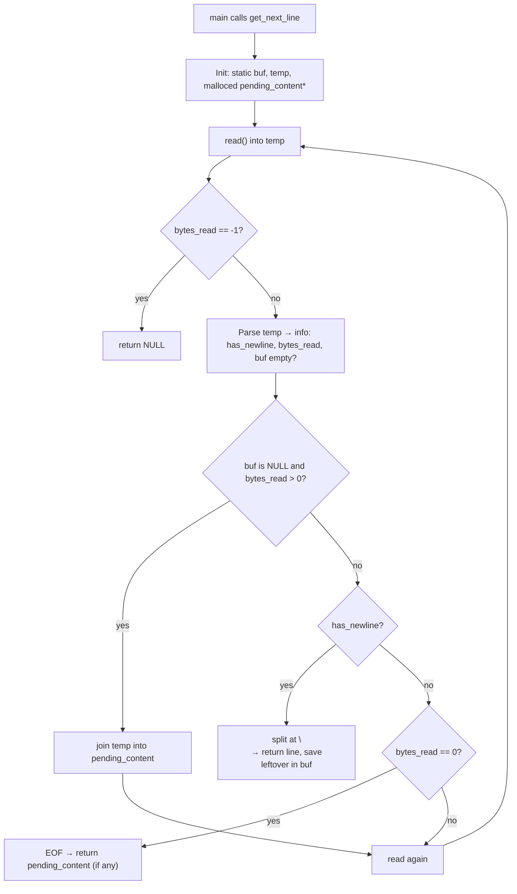

```mermaid
flowchart TD
    start["main calls get_next_line"] --> init["Init: static buf, temp, malloced pending_content*"]

    init --> readfd["read() into temp"]
    readfd --> checkErr{bytes_read == -1?}
    checkErr -->|yes| err["return NULL"]
    checkErr -->|no| parse["Parse temp → info: has_newline, bytes_read, buf empty?"]

    parse --> cond1{buf is NULL and bytes_read > 0?}
    cond1 -->|yes| join["join temp into pending_content"]

    cond1 -->|no| cond2{has_newline?}
    cond2 -->|yes| split["split at \\n → return line, save leftover in buf"]
    cond2 -->|no| cond3{bytes_read == 0?}
    cond3 -->|yes| eof["EOF → return pending_content (if any)"]
    cond3 -->|no| loop["read again"]

    join --> loop
    loop --> readfd
```
