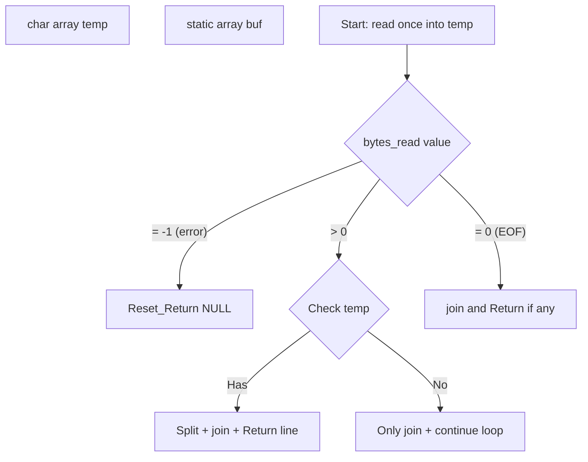

```mermaid
flowchart TD;
a[char array temp]
b[static array buf]
A[Start: read once into temp] --> B{bytes_read value};
B -->|"= -1 (error)"| E[Reset_Return NULL];
B -->|> 0| C{Check temp};
B -->|"= 0 (EOF)"| D[join and Return if any];

C -->|Has \n| F[Split + join + Return line];
C -->|No \n| G[Only join + continue loop];

```